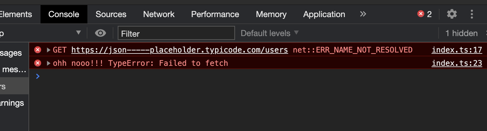

# JS Promises

## Table of Contents

- [About](#about)
- [Getting Started](#getting_started)
- [Tools](#tools)
- [Promise-State](#promise-state)
- [Catch](#catch)
- [Finally](#finally)

## About <a name = "about"></a>

JS-promises a huge feature of how we can handle asynchronous code in our javascript programs.
This Repository will take up the fundamentals and to explain to core concepts how they actually work and how you can use them in your code base.

## Getting Started <a name = "getting_started"></a>

### start server

to be able to start the server run `npm run json-server`
now when the server is started, check your terminal and you will se what endpoint you have access to.
You could also modify the data in `db.json`

## Promise State <a name = "promise-state"></a>

there is 3 possible states that or promise can be in

- Pending
- Fulfilled
- Rejected

Before our result is ready the promise is the pending state.

```js
const x = fetch("https://jsonplaceholder.typicode.com/users").then(
  response => response
)
```

when the promise is available then the promise change it state to `fulfilled`.

if something bads happened the promise gets `rejected`.
if the promise has either been fulfilled ore rejected we usually says that the promise has been settled. It can't now change it's state to something else.

## Promise-chain <a name = "promise-chain"></a>

Simply promise chain is when we can chain our response into the the next step.
For example:

```js
const x = fetch("https://jsonplaceholder.typicode.com/users")
  .then(response => response.json())
  .then(users => {
    console.log(users)
    console.log(users.length)
  })
// (10) [{…}, {…}, {…}, {…}, {…}, {…}, {…}, {…}, {…}, {…}]
// 10
```

We return the data in to next `promise chain` where we can console.log out the result and length of the users list

## Catch Errors <a name = "catch"></a>

What would happened if something wrong would happened on the way from out request? We would like to catch somehow our errors to handle the on some kind of way.
When using promise chaining we can add another chain at the end names `.catch()` that will catch our errors if the promise has been rejected.
Remember the we can nly bee in on state, either `fulfilled` ore `rejected`.
So using the same example above we could add the `.catch()` at the end and catch any errors, if so.

For example let's change the url

```js
const x = fetch("https://json-----placeholder.typicode.com/users")
  .then(response => response.json())
  .then(users => {
    console.log(users)
    console.log(users.length)
  })
  .catch(err => console.error("ohh nooo!!!", err))
console.log(x)
```



## Finally <a name = "finally"></a>

The `Promise.prototype.finally()` m​e​t​h​o​d lets you attach a callback to a promise that is executed once that promise is settled(`fulfilled` ore `rejected`). It used when you want to clean up the logic, for example if u suing a pinner you don't want to still show the spinner if the promise has been rejected, then `.finally()` is a great option to use here.

## Tools <a name = "tools"></a>

- Promises
- Typescript
